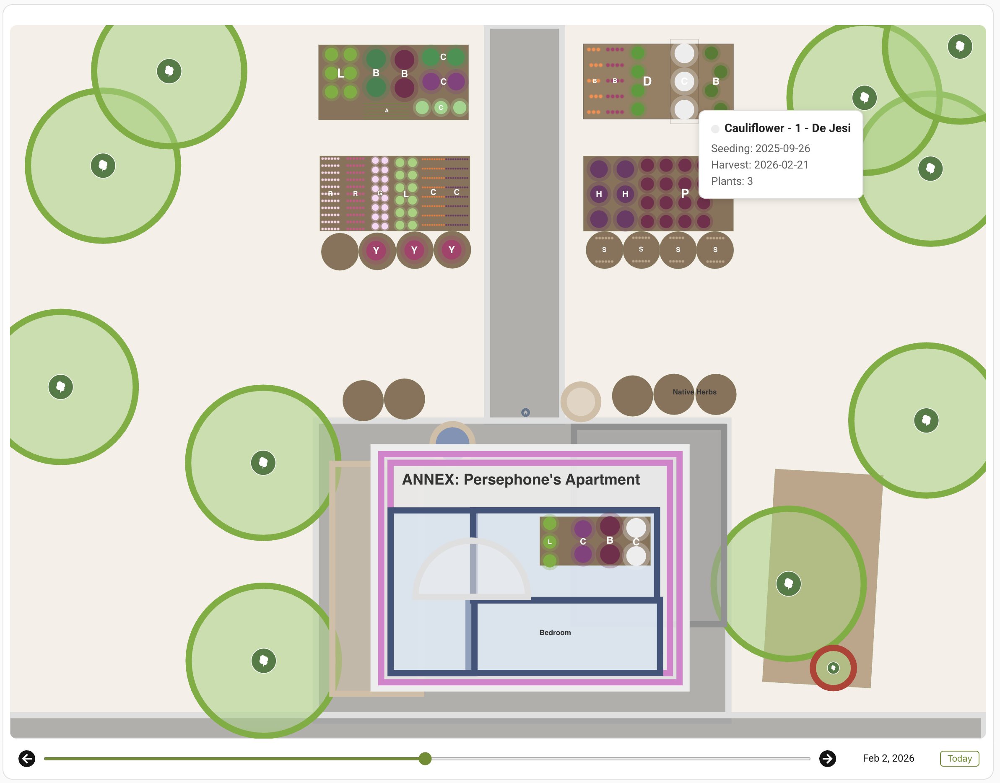

# Seedtime Garden Planner — Home Assistant Integration



A custom Home Assistant integration that connects to [Seedtime.us](https://seedtime.us) and renders your garden plan as an interactive SVG card with crop tooltips and a timeline slider.

## Features

- **Interactive SVG garden plan** rendered from your Seedtime account data, displayed as a Lovelace card
- **Crop tooltips** — hover or tap on any planting to see crop name, seeding/harvest dates, and plant count
- **Timeline slider** — scrub through past and future dates to see which crops occupy each bed at any point in the season
- **Calendar entity** — seeding and harvest milestones appear on your HA calendar
- **Image entity** — the garden plan SVG is served as a standard HA image entity

## Prerequisites

- A [Seedtime.us](https://seedtime.us) account with at least one garden plan
- Home Assistant 2024.1 or later
- [card-mod](https://github.com/thomasloven/lovelace-card-mod) (optional, for card styling)

## Installation

### HACS (Manual Repository)

1. Open HACS in your HA instance
2. Go to **Integrations** > three-dot menu > **Custom repositories**
3. Add `https://github.com/PersephoneKarnstein/ha-seedtime` with category **Integration**
4. Search for "Seedtime Garden Planner" and install
5. Restart Home Assistant

### Manual Installation

1. Copy the `custom_components/seedtime/` directory into your Home Assistant `config/custom_components/` directory:

   ```
   config/
     custom_components/
       seedtime/
         __init__.py
         api.py
         calendar.py
         config_flow.py
         const.py
         coordinator.py
         garden_renderer.py
         image.py
         manifest.json
         strings.json
         translations/
           en.json
         www/
           seedtime-garden-card.js
   ```

2. Restart Home Assistant.

## Configuration

1. Go to **Settings** > **Devices & Services** > **Add Integration**
2. Search for **Seedtime Garden Planner**
3. Enter your Seedtime email and password
4. The integration will validate your credentials and set up the garden plan entities

### Options

After setup, click **Configure** on the integration to adjust:

| Option | Default | Description |
|---|---|---|
| Enable calendar entity | On | Show seeding/harvest events on your HA calendar |
| Update interval | 1800s (30 min) | How often to poll the Seedtime API (range: 300–7200s) |

## Lovelace Card Setup

### 1. Register the card resource

Add the following to your Lovelace dashboard resources (Settings > Dashboards > Resources, or via YAML):

```yaml
resources:
  - url: /seedtime/seedtime-garden-card.js
    type: module
```

### 2. Add the card

Add a **Manual** card with:

```yaml
type: custom:seedtime-garden-card
entity: image.seedtime_garden_plan
title: My Garden    # optional, defaults to garden name from Seedtime
```

### Timeline Slider

The card includes a date timeline at the bottom:

- **Drag the slider** to see which crops occupy each bed on any date in the garden's history
- **Arrow buttons** step forward/back one day at a time
- **Today button** snaps back to the current date

Crops are shown or hidden based on their `groundOccupationStart` and `groundOccupationEnd` dates from the Seedtime API. All formations are pre-rendered in the SVG and filtered client-side for instant responsiveness.

## Entities Created

| Entity | Type | Description |
|---|---|---|
| `image.seedtime_garden_plan` | Image | SVG render of the garden plan |
| `calendar.seedtime_garden_tasks` | Calendar | Seeding and harvest milestone events |

### Image Entity Attributes

| Attribute | Description |
|---|---|
| `garden_title` | Name of the garden in Seedtime |
| `plan_width` | Garden plan width (Seedtime units) |
| `plan_height` | Garden plan height (Seedtime units) |
| `location_count` | Number of planting locations (beds) |
| `crop_count` | Number of unique crop varieties |

## Updating After Changes

- **Python file changes** (`garden_renderer.py`, `api.py`, etc.) require a full HA restart via Developer Tools > YAML > Restart. HA caches imported Python modules, so integration reloads alone are not sufficient.
- **JavaScript card changes** (`seedtime-garden-card.js`) only need a hard browser refresh (Ctrl+Shift+R). If the custom element is still cached, navigate to `about:blank` and back to force a clean load.

## Architecture Notes

- The SVG is generated server-side in Python (`garden_renderer.py`) and served as an HA image entity. The Lovelace card fetches the SVG and injects it as live DOM (not ``) so tooltip listeners can be attached to individual crop elements.
- All non-draft planting formations are rendered into the SVG with `data-ground-start` and `data-ground-end` attributes. The timeline slider filters visibility client-side using these attributes, avoiding round-trips to the server.
- The integration authenticates via Seedtime's Devise form login (CSRF token + POST) and then uses the GraphQL API to fetch garden plan data.

## Troubleshooting

**Integration not appearing in Add Integration:** Make sure the `seedtime/` folder is directly inside `custom_components/` and restart HA.

**"Entity not found" in the card:** Verify the entity ID matches — check Developer Tools > States for the actual entity ID.

**Stale garden data:** The integration polls every 30 minutes by default. You can lower this in the integration options (minimum 5 minutes).

**Card not loading after JS update:** HA aggressively caches custom elements. Try navigating to `about:blank` in the browser tab, then back to your dashboard.
